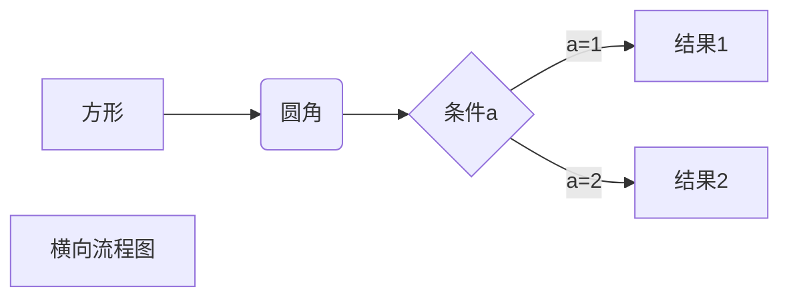
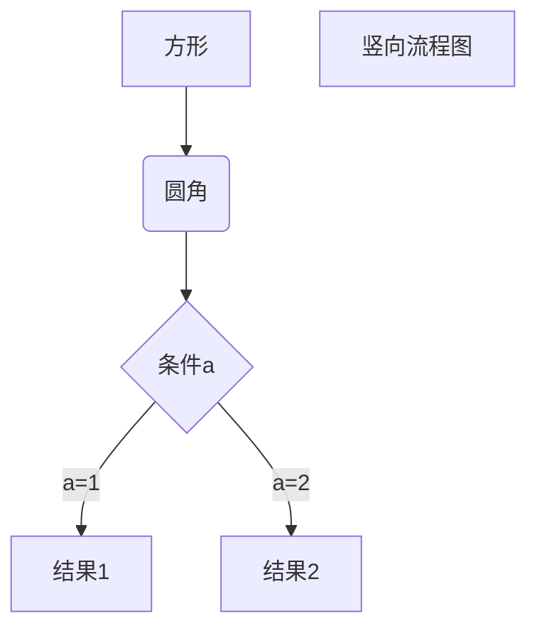
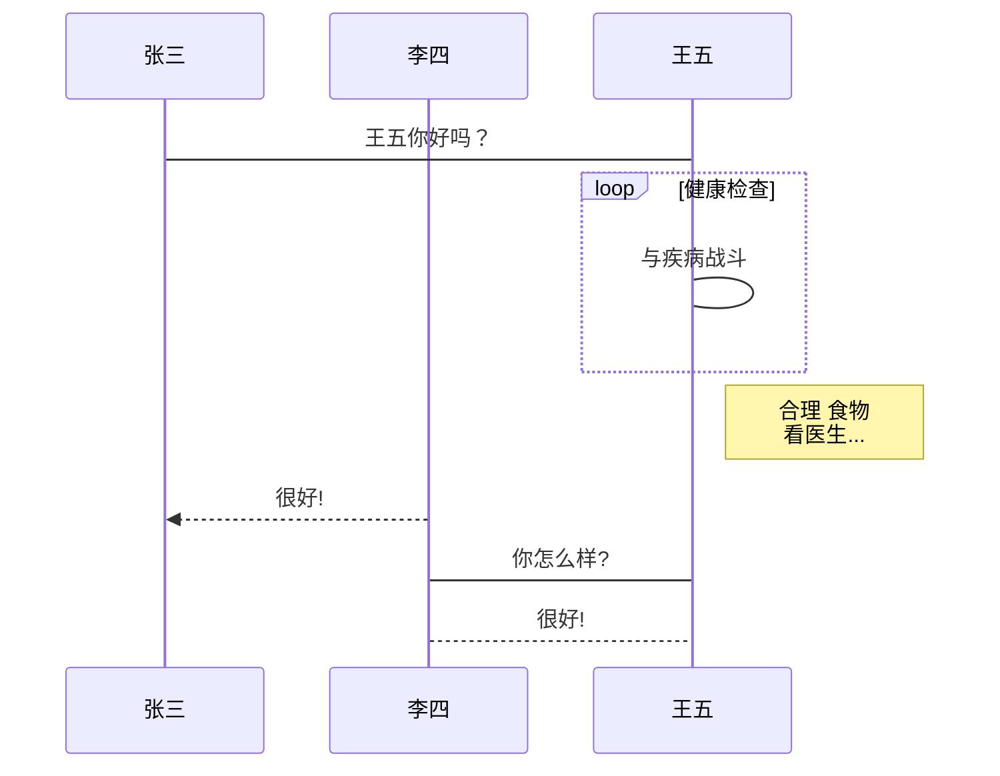
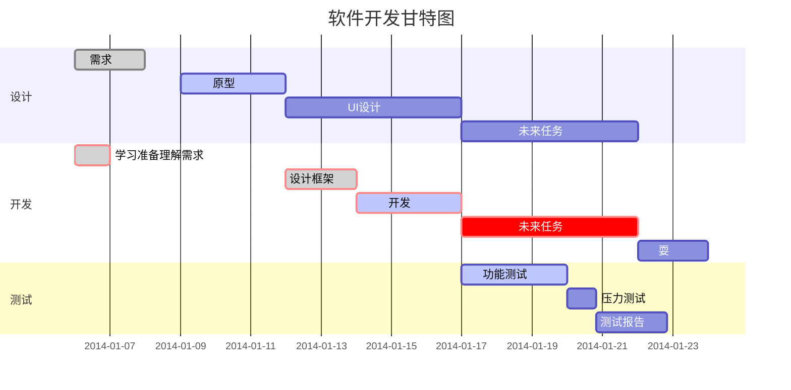

markdown教程
Markdown 是一种轻量级标记语言，它允许人们使用易读易写的纯文本格式编写文档。
Markdown 语言在 2004 由约翰·格鲁伯（英语：John Gruber）创建。
Markdown 编写的文档可以导出 HTML 、Word、图像、PDF、Epub 等多种格式的文档。
Markdown 编写的文档后缀为 .md, .markdown。

markdown基本语法
标题
我展示的是一级标题
==
我展示的是二级标题
--
#标题
# 这是一级标题
## 这是二级标题
### 这是三级标题
#### 这是四级标题
##### 这是五级标题
###### 这是六级标题

段落
Markdown 段落没有特殊的格式，直接编写文字就好，段落的换行是使用两个以上空格加上回车。
markdown  (末尾添加两个空格)
markdown

markdown(也可以回车空行来换行)

字体
*斜体文本*
_斜体文本_
**粗体文本**
__粗体文本__
***粗斜体文本***
___粗斜体文本___
~~粗斜体文本~~
分割线
你可以在一行中用三个以上的星号、减号、底线来建立一个分隔线，行内不能有其他东西。你也可以在星号或是减号中间插入空格。
下面每种写法都可以建立分隔线：

`***`
***
`* * *`
* * *
列表
无序列表
- 文本1
- 文本2
- 文本3

有序列表
1. 文本1
2. 文本2
3. 文本3

列表嵌套
1. 第一项：
- 第一项嵌套的第一个元素
- 第一项嵌套的第二个元素

2. 第二项：
- 第二项嵌套的第一个元素
- 第二项嵌套的第二个元素
引用
引用的文字前面加上 > 就好了
`> 一盏灯， 一片昏黄；`
> 一盏灯， 一片昏黄；

代码
单行代码
<pre> `单行代码` </pre>
`单行代码`
多行代码
<pre>
```
多行代码
多行代码
多行代码
多行代码
```
</pre>
```
多行代码
多行代码
多行代码
多行代码
```

表格
-代表默认左对齐
:-:  代表两端对齐
-: 代表右对齐
自带隔行换色
```
| Tables | Are | Cool |
| ------------- |:-------------:| -----:|
| col 3 is | right-aligned | $1600 |
| col 2 is | centered | $12 |
| zebra stripes | are neat | $1 |
```

| Tables | Are | Cool |
| ------------- |:-------------:| -----:|
| col 3 is | right-aligned | $1600 |
| col 2 is | centered | $12 |
| zebra stripes | are neat | $1 |

脚注
脚注是对文本的补充说明。 Markdown 脚注的格式如下:
[^要注明的文本]
[^要注明的文本]: 这是要注明的文本
```
[^要注明的文本]
[^要注明的文本]: 这是要注明的文本
```

区块
在段落开头使用 > 符号 ，然后后面紧跟一个空格符号：
> 区块引用
> 区块引用2
> 区块引用3
```
> 区块引用
> 区块引用2
> 区块引用3
```
区块嵌套
一个 > 符号是最外层，两个 > 符号是第一层嵌套，以此类推：
> 最外层
> > 第一层嵌套
> > > 第二层嵌套
```
> 最外层
> > 第一层嵌套
> > > 第二层嵌套
```
区块中使用列表 区块中使用列表实例如下：
> 区块中使用列表
> 1. 第一项
> 2. 第二项
> + 第一项
> + 第二项
> + 第三项
```
> 1. 第一项
> 2. 第二项
> + 第一项
> + 第二项
> + 第三项
```
列表中使用区块 如果要在列表项目内放进区块，那么就需要在 > 前添加四个空格的缩进。
区块中使用列表实例如下：

* 第一项
> 第一项子项
> 第一项子项
* 第二项

```
* 第一项
> 第一项子项
> 第一项子项
* 第二项
```

图片链接

[显示文本](链接地址)

```
[显示文本](链接地址)

Markdown 还没有办法指定图片的高度与宽度，如果你需要的话，你可以使用普通的  标签。
```

高级链接
我们可以通过变量来设置一个链接，变量赋值在文档末尾进行：
这个链接用 1 作为网址变量 [Google][1]
这个链接用 baidu作为网址变量 [baidu][baidu]
然后在文档的结尾为变量赋值（网址）
[1]: http://www.google.com/
[baidu]: http://www.baidu.com/

markdown高级教程
支持的 HTML 元素 不在 Markdown 涵盖范围之内的标签，都可以直接在文档里面用 HTML 撰写。 目前支持的 HTML 元素有：
<kbd> <b> <i> <em> <sup> <sub> <br>等 ，如：

使用 <kbd>Ctrl</kbd>+<kbd>Alt</kbd>+<kbd>Del</kbd> 重启电脑

转义
Markdown 使用了很多特殊符号来表示特定的意义，如果需要显示特定的符号则需要使用转义字符，Markdown 使用反斜杠转义特殊字符：
**文本加粗**
\*\* 正常显示星号 \*\*

Markdown 支持以下这些符号前面加上反斜杠来帮助插入普通的符号：
```
\ 反斜线
` 反引号
* 星号
_ 下划线
{} 花括号
[] 方括号
() 小括号
# 井字号
+ 加号
- 减号
. 英文句点
! 感叹号
```
公式 当你需要在编辑器中插入数学公式时，可以使用两个美元符 $$ 包裹 TeX 或 LaTeX 格式的数学公式来实现。提交后，问答和文章页会根据需要加载 Mathjax 对数学公式进行渲染。如：
$$
\mathbf{V}_1 \times \mathbf{V}_2 = \begin{vmatrix}
\mathbf{i} & \mathbf{j} & \mathbf{k} \\
\frac{\partial X}{\partial u} & \frac{\partial Y}{\partial u} & 0 \\
\frac{\partial X}{\partial v} & \frac{\partial Y}{\partial v} & 0 \\
\end{vmatrix}
${$tep1}{\style{visibility:hidden}{(x+1)(x+1)}}
$$

typora 画流程图、时序图(顺序图)、甘特图
复制以下代码使用 typora 的源码模式粘贴到编辑器中查看效果：

1、横向流程图源码格式：



2、竖向流程图源码格式：



3、标准流程图源码格式：

```flow
st=>start: 开始框 
op=>operation: 处理框 
cond=>condition: 判断框(是或否?) 
sub1=>subroutine: 子流程 
io=>inputoutput: 输入输出框 
e=>end: 结束框 
st->op->cond 
cond(yes)->io->e 
cond(no)->sub1(right)->op

```

4、标准流程图源码格式（横向）：

```flow
st=>start: 开始框 
op=>operation: 处理框 
cond=>condition: 判断框(是或否?) 
sub1=>subroutine: 子流程 
io=>inputoutput: 输入输出框 
e=>end: 结束框 
st(right)->op(right)->cond 
cond(yes)->io(bottom)->e 
cond(no)->sub1(right)->op

```

5、UML时序图源码样例：

```sequence
对象A->对象B: 对象B你好吗?（请求） 
Note right of 对象B: 对象B的描述 
Note left of 对象A: 对象A的描述(提示) 
对象B-->对象A: 我很好(响应) 
对象A->对象B: 你真的好吗？

```

6、UML时序图源码复杂样例：

```sequence
Title: 标题：复杂使用 
对象A->对象B: 对象B你好吗?（请求） 
Note right of 对象B: 对象B的描述 
Note left of 对象A: 对象A的描述(提示) 
对象B-->对象A: 我很好(响应) 
对象B->小三: 你好吗 
小三-->>对象A: 对象B找我了 
对象A->对象B: 你真的好吗？ 
Note over 小三,对象B: 我们是朋友 
participant C 
Note right of C: 没人陪我玩

```

7、UML标准时序图样例：



8、甘特图样例：



